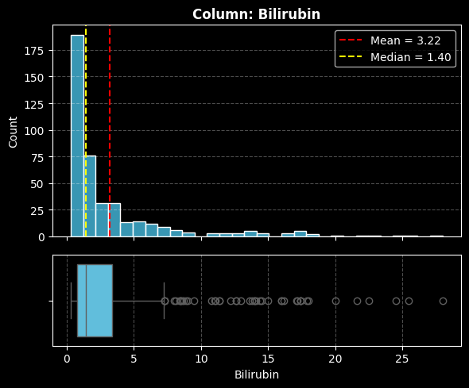
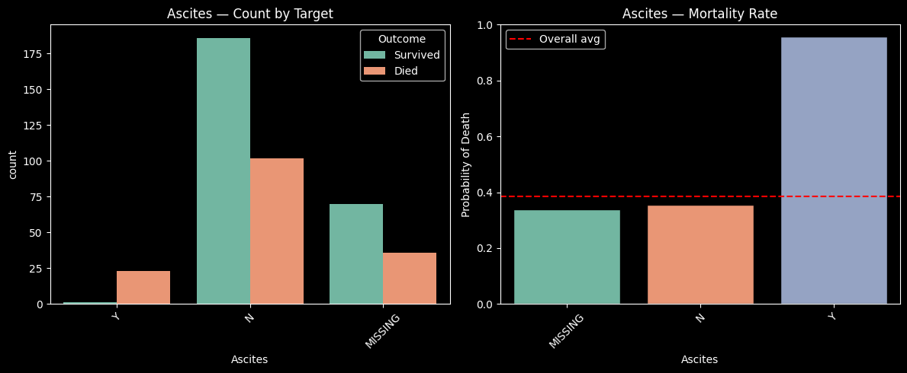
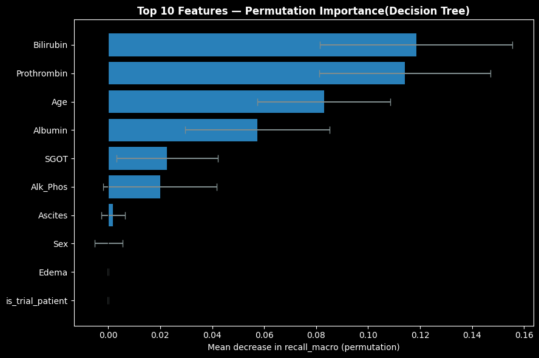

# Cirrhosis Mortality Prediction

Binary classification of mortality risk in cirrhosis patients using clinical and lab features. Built as a learning project combining biomedical domain knowledge with ML.

---

## Problem

Cirrhosis patients face widely varying mortality risk. Early identification of high-risk patients can guide clinical decisions. This project frames it as a binary classification task: **survived (0) vs. died (1)**.

Missing a death (false negative) is a worse error than a false alarm. The primary metric is therefore **recall_macro**, which weighs recall equally across both classes regardless of imbalance.

---

## Dataset

- **Source**: [Mayo Clinic PBC (Primary Biliary Cirrhosis) dataset](https://www.kaggle.com/datasets/fedesoriano/cirrhosis-prediction-dataset)
- **Size**: 424 patients, 80/20 train-test split
- **Target distribution**: ~60% survived (0), ~40% died (1) — moderate imbalance
- **Features**: Age, sex, clinical signs (ascites, edema), lab values (Bilirubin, Prothrombin, Albumin, SGOT, Alk_Phos), disease stage, trial participation

---

## EDA Highlights

**Bilirubin** is heavily right-skewed (mean 3.22, median 1.40) with extreme outliers up to 28. A log transformation was applied before modeling.



**Ascites** is the strongest categorical predictor. Patients with ascites have ~95% mortality rate, nearly 3x the overall average.



---

## Features Used

Top features by permutation importance (Decision Tree). Bilirubin, Prothrombin, Albumin, and Stage align with the established Mayo PBC prognostic score, confirming the model is learning real clinical signal.



| Rank | Feature |
|---|---|
| 1 | Bilirubin |
| 2 | Prothrombin |
| 3 | Age |
| 4 | Albumin |
| 5 | SGOT |
| 6 | Alk_Phos |
| 7 | Ascites |
| 8 | Sex |

---

## Models Trained

All models used `class_weight='balanced'` (where applicable) and were tuned via 5-fold cross-validated GridSearchCV on recall_macro.

| Model | CV recall_macro | Test recall_macro | Train recall_macro | Gap |
|---|---|---|---|---|
| Decision Tree | 0.7008 | 0.78 | 0.94 | 0.16 |
| **Logistic Regression** | **0.7669** | **0.78** | **0.77** | **0.01** |
| KNN | 0.7368 | 0.75 | 0.78 | 0.03 |
| Random Forest | 0.7576 | 0.78 | 1.00 | 0.22 |

**Best hyperparameters (Logistic Regression):**
- `C: 0.001`, `penalty: l2`, `solver: lbfgs`, `class_weight: balanced`

**Test set performance (Logistic Regression):**

```
              precision    recall  f1-score   support

           0       0.82      0.87      0.84        52
           1       0.76      0.69      0.72        32

    accuracy                           0.80        84
   macro avg       0.79      0.78      0.78        84
weighted avg       0.80      0.80      0.80        84
```

---

## Model Selection

Test recall_macro ties at 0.78 across Decision Tree, Logistic Regression, and Random Forest. **Logistic Regression is selected** for three reasons:

1. Smallest train-test gap (0.01) — it actually generalizes
2. Decision Tree (gap: 0.16) and Random Forest (gap: 0.23) are disqualified due to overfitting
3. Logistic Regression coefficients are directly interpretable by clinicians, which matters for clinical deployability

---

## Known Limitations

| Limitation | Impact |
|---|---|
| **Small dataset (n=424)** | CV variance is wide (~±0.03-0.05). Results need validation on a larger independent cohort. |
| **MNAR missingness (n=112)** | MICE imputes plausible values but cannot recover information that was structurally never collected. Imputed patients may skew model behavior. |
| **No external validation** | All metrics are from an 80/20 split of the same dataset. Generalization to other PBC cohorts is unknown. |
| **N_Days dropped** | The most predictive variable was excluded due to leakage. A time-to-event model (Cox PH) would be more appropriate for this data structure. |
| **Class imbalance (~40/60)** | Handled with `class_weight='balanced'`, but minority class recall on a small test set is still noisy. |
| **Drug excluded** | We cannot assess treatment effect because Drug assignment is structurally MNAR for 26% of patients. |

---

## Conclusion

This notebook demonstrates a complete, scientifically careful ML pipeline on a real clinical dataset. The key methodological decisions — dropping `N_Days` to prevent leakage, treating `Drug` missingness as structural rather than random, splitting before imputation/encoding, using MICE inside a pipeline, and scoring on recall_macro rather than accuracy — are grounded in the clinical context of the problem.

The top features identified by permutation importance (Bilirubin, Prothrombin, Albumin, Stage) align precisely with the established Mayo PBC prognostic score, which is a meaningful validation that the model is learning real signal rather than noise.

*Dataset: Mayo Clinic Cirrhosis (424 rows, 17 modeled features, ~40% mortality rate)*

---

## Project Structure

```
cirrhosis-mortality/
├── cirrhosis_fixed.ipynb     # Full pipeline: EDA, preprocessing, modeling, evaluation
├── README.md
└── assets/
    ├── bilirubin_distribution.png
    ├── ascites_mortality.png
    └── permutation_importance.png
```

---

## Stack

- Python 3
- pandas, numpy
- scikit-learn
- matplotlib, seaborn

---

## Author

**Ali Abu Sohiban**
Biotechnology graduate, Islamic University of Gaza. Former research assistant, currently learning data science and ML with a focus on bioinformatics applications.
